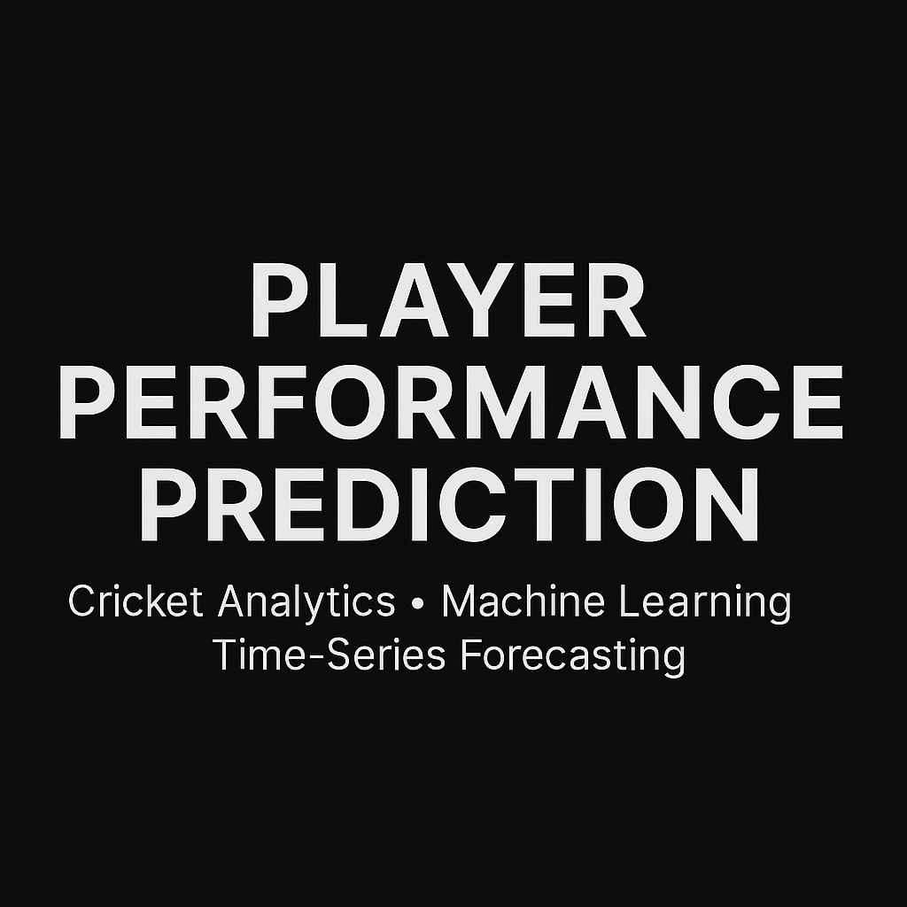
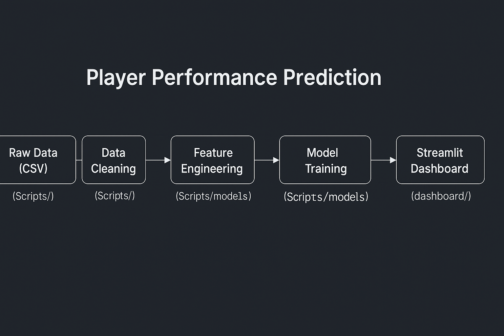
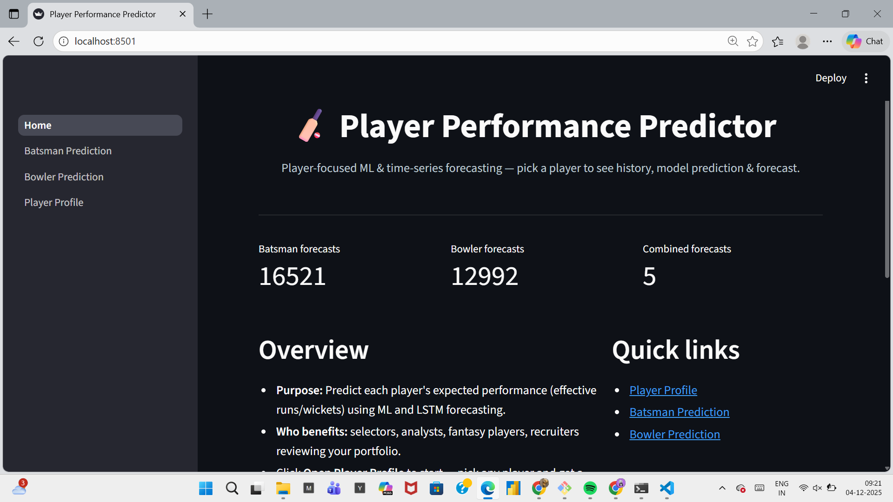
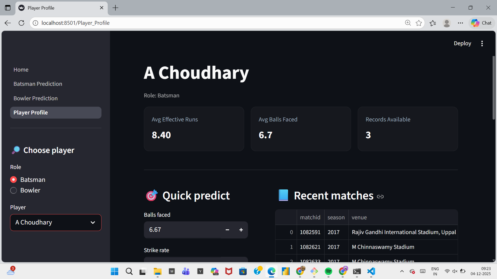
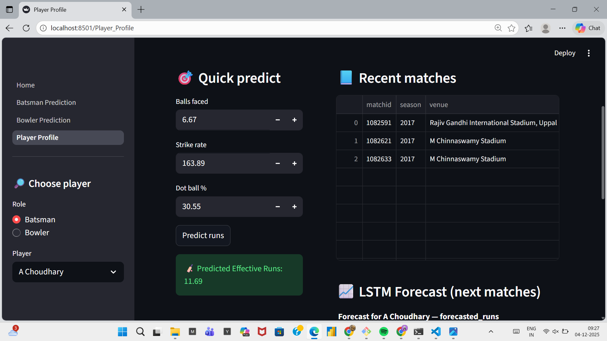
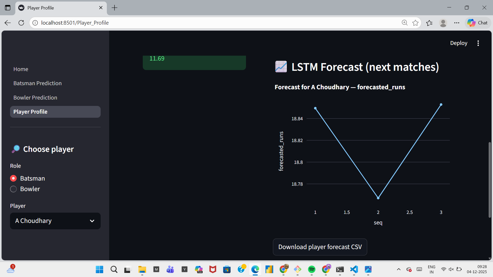

<!-- Banner -->
<p align="center">
  
</p>

<h1 align="center">🏏 Player Performance Prediction</h1>

<p align="center">
A complete end-to-end cricket analytics project built using Python, Machine Learning, and Time-Series Forecasting.<br>
This project predicts batsman & bowler performance, visualizes insights, and provides interactive dashboards using Streamlit.
</p>

---

## 📌 Overview

This project processes raw cricket match data, engineers cricket-specific features, trains ML & forecasting models, and presents results in an interactive dashboard.

It demonstrates:
- **Data Engineering**
- **Feature Engineering**
- **ML Model Development**
- **ARIMA/SARIMA/LSTM Forecasting**
- **Interactive Dashboard Creation**

A fully functional end-to-end data pipeline.

---

## 🚀 Demo (GIF)

<p align="center">
  
</p>

---

## 🏗 Project Architecture

<p align="center">
  
</p>

---

## 📊 Dashboard Features

---

### 🔹 **Home Page**
<p align="center">
  
</p>

- Project introduction  
- Navigation panel  
- Overview of prediction modules  

---

### 🔹 **Player Profile**
<p align="center">
  
</p>

- Historical performance overview  
- Metrics: effective runs, strike rate, dot-ball %, balls faced  
- Bowler stats: overs, economy, wickets  

---

### 🔹 **Prediction Module**
<p align="center">
  
</p>

- Predict **effective runs** (batsmen)  
- Predict **effective wickets** (bowlers)  
- Uses trained ML regression models  

---

### 🔹 **Forecasting**
<p align="center">
  
</p>

- LSTM / ARIMA time-series forecasting  
- Next 5-match prediction  
- Downloadable forecast CSV  

---

## 📂 Folder Structure

Player-Performance-Prediction/
│
├── dashboard/
│ ├── Home.py
│ └── pages/
│ └── Player_Profile.py
│
├── Scripts/
│ ├── feature_engineering.py
│ ├── model_training.py
│ └── predict_module.py
│
├── data_clean/
├── models/
│
├── assets/
│ ├── banner.png
│ ├── architecture_diagram.png
│ ├── home.png
│ ├── player_profile.png
│ ├── prediction.png
│ ├── forecast.png
│ └── video_demo.gif
│
├── requirements.txt
└── README.md


---

## 🔧 How to Run Locally

### 1️⃣ Clone the Repository
```bash
git clone https://github.com/Likithasriram/Player-Performance-Prediction.git
cd Player-Performance-Prediction

2️⃣ Create a Virtual Environment
python -m venv venv
venv\Scripts\activate     # Windows

3️⃣ Install Dependencies
pip install --upgrade pip
pip install -r requirements.txt

4️⃣ Run the Streamlit App
streamlit run dashboard/Home.py


Open browser at → http://localhost:8501

🤖 Models Used
Machine Learning Models

Linear Regression

Random Forest Regressor

Gradient Boosting Regressor

Time-Series Models

ARIMA

SARIMA

LSTM (Neural Network)

🧠 Skills Demonstrated

✔ Data Cleaning & Preprocessing
✔ Feature Engineering
✔ ML Regression Modeling
✔ LSTM & ARIMA Forecasting
✔ Modular Python Development
✔ Streamlit Dashboard Design
✔ Git & Version Control
✔ End-to-End Pipeline Building

📝 Resume-Ready Description

Developed an end-to-end cricket player performance prediction system using Python.
Implemented ETL pipelines, engineered cricket-specific features, and trained ML + LSTM forecasting models to predict future runs and wickets.
Built an interactive Streamlit dashboard to visualize insights, trends, and player forecasting.

## Why this project matters

This project demonstrates practical, transferable skills used in industry analytics pipelines:
- **End-to-end workflow**: data ingestion, cleaning, feature engineering, modeling, and interactive visualization.
- **Actionable forecasting**: produces forecasts and per-player summaries that can be used by analysts and coaches for decision-making.
- **Reproducibility & structure**: modular code and clear documentation make the work reproducible and production-ready.

## Future Enhancements

Planned improvements to make the project production-grade:
- Add automatic data ingestion from a live API or streaming source.
- Move large model artifacts to cloud storage (S3) and download at runtime.
- Implement CI/CD pipeline to automate tests and deployment.
- Add user authentication and role-based views in the dashboard.
- Improve forecasting accuracy with ensembling and external features (weather, pitch).


👨‍💻 Author

Likitha Sriram
Data Analyst & Machine Learning Enthusiast

🔗 GitHub: https://github.com/Likithasriram
